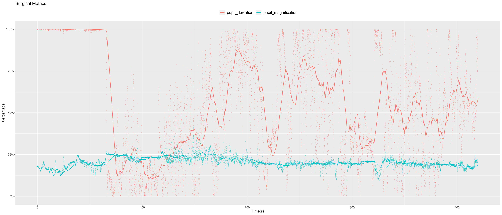
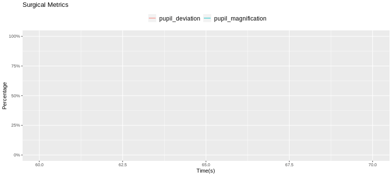

Rotation advisor: [Yin Li, PhD](https://www.biostat.wisc.edu/~yli/).

In collaboration with: [Stephen K. Sauer, MD](https://www.uwhealth.org/providers/stephen-k-sauer-md).

### Motivation

* Cataracts are the leading cause of blindness in the world, according to the World Health Organization.

* Cataracts Surgeries are the most common surgical interventions performed in the world (~19M interventions / year).

* Cataract cases are estimated to increase 78% by 2050. 

* Ophthalmology residents spend a large portion of their training in learning cataract surgery. 

* A key challenge in the training is to develop a systematic and objective assessment of the surgical competency of the residents. 

### Results

* The trained Mask R-CNN model achieves outstanding performance detecting pupils and twelve different surgical tools.
* We are able to monitor important metrics such as pupil deviation and pupil magnification in real-time. 

Pupil | mAP (IoU=0.50:0.95) | AP50 | AP75
:---:|:---:|:---:|:---:|
Segmentation |81.13 |96.98 |86.19 |

Surgery Clip               |  Real-Time Monitoring
:-------------------------:|:-------------------------:
  |  

### Dataset 

* [CaDIS](https://cataracts.grand-challenge.org/CaDIS/)
* 4738 images extracted from 25 videos with corresponding semantic annotation.
* Training: 3582, Validation: 542, Testing: 614. 

### Method

* [Mask R-CNN](https://arxiv.org/abs/1703.06870)
* [Detectron2](https://github.com/facebookresearch/detectron2)

