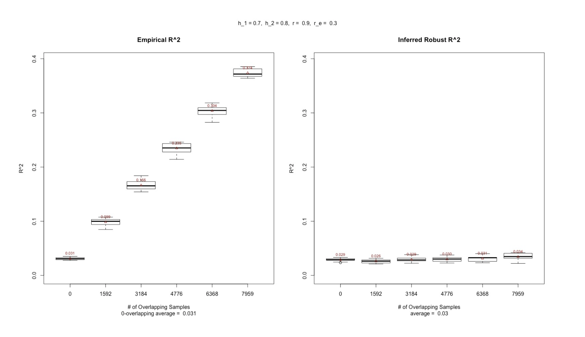

Rotation advisor: [Qiongshi Lu, PhD](https://qlu-lab.org/).

### Motivation

* We can utilize GWAS summary statistics from major reference data sources such as UK Biobank to calculate polygenic risk scores (PRSs) for genetic risk prediction on another data set. 
* Even better, PRSs are natural instrumental variables. We can use them as proxies to investigate the genetic associations between different phenotypes. 
* However, two data set might suffer from overfitting due to sample-overlapping. 
* **How can we make valid and robust inferences under sample-overlapping?**

### Results 

* Our proposed method can robustly estimate R^2 between PRS and another phenotype using only GWAS summary statistics.

### Methods 

See details in the slides. 
