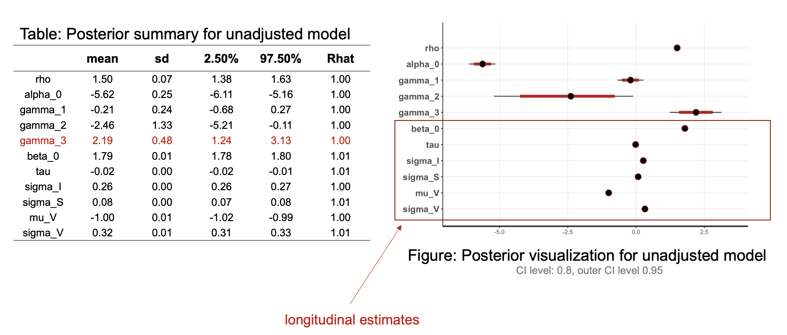
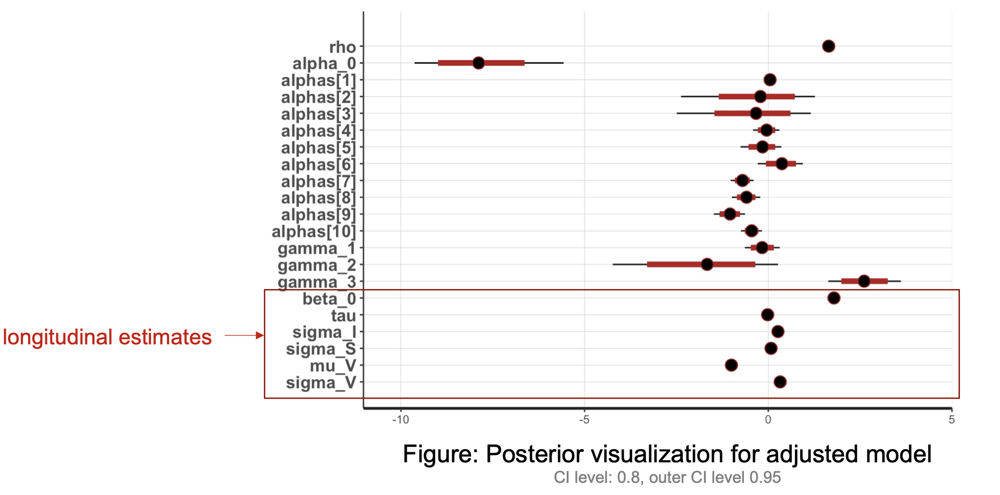

Rotation advisor: [Lu Mao, PhD](https://sites.google.com/view/lmaowisc/home).

In collaboration with: [Beini Lyu, PhD](https://publichealth.jhu.edu/faculty/4235/beini-lyu) & [Brad Astor, PhD, MPH](https://www.medicine.wisc.edu/people-search/people/staff/1054/Astor_Brad). 

### Motivation

* Patients with kidney transplantation need to take immunosuppressive therapy medication regularly.
* Commonly used drugs are calcineurin inhibitors (CNI), e.g., tacrolimus and cyclosporine.
* The therapeutic level for tacrolimus is 10-15ng/mL for the first 6 weeks after transplantation, and 5- 10 ng/ml thereafter.
* **Is poor adherence associated with poor survival outcomes?** 

### Results 

* Higher CNI variability is indeed associated with poorer survival outcome.

### Methods 

We use [Stan](https://mc-stan.org/) to build a Bayesian joint model of longitudinal and survival data. 
